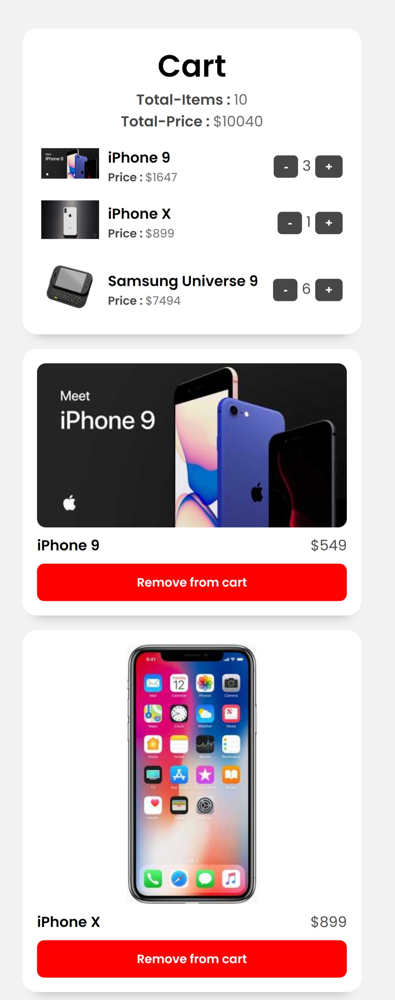

# Shopping-Cart

It is a simple shopping cart application. Here you will see the list of products through an API call and then you can add them or remove them to the Cart and from the Cart.

## Table of contents

- [Designs](#designs)
- [Link](#links)
- [Built With](#built-with)
- [What I learned](#what-i-learned)
- [Author](#author)

### Links

- Live Site URL : [Shoping-Cart](https://ajaysinhaorigin.github.io/Shopping-Cart/)

### Designs

  

### Built with

- ReactJS
- Axios
- CSS3 custom properties  
- Grid & Flex
- Semantic HTML5 markup

### What I learned

- ReactJS Practice
- Axios
- Array Methods
- CSS Media Quary

### Author

- Frontend Mentor  - [@ajaysinhaorigin](https://www.frontendmentor.io/profile/ajaysinhaorigin)
